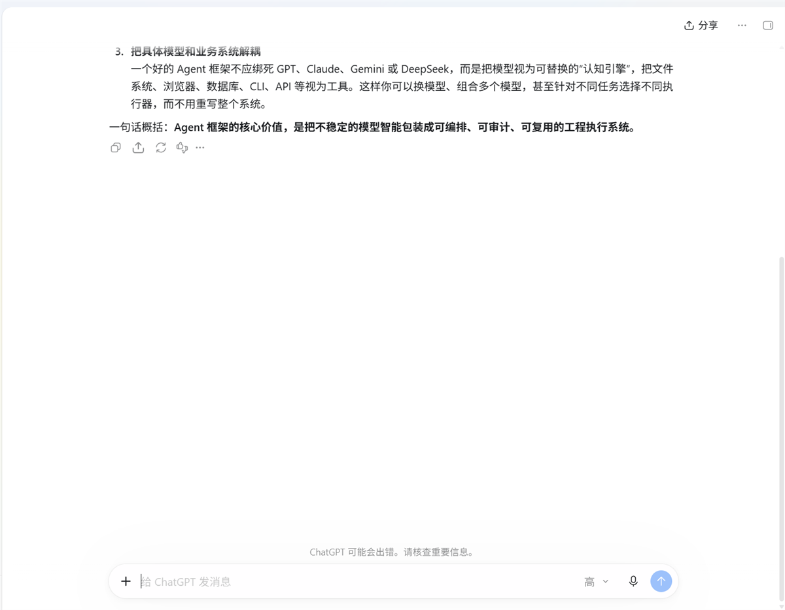

# dsh-win-computer-use

> 状态：✅ 已交付 · 发布件就绪（Status: delivered · publish-ready · not yet listed in the community catalog）
>
> [中文说明 →](README.zh.md)

Windows-native computer use for [DeepSeek Harness](https://github.com/deepseek-ai/deepseek-harness).
One batch tool runs a whole **find → click → type → wait → screenshot** sequence inside a single
engine request, and drives windows through **focus-free** paths — so the agent works on this
machine without taking over the desktop you are using.



## What it saves

These are readings, not estimates. DeepSeek Harness records `usage` on every assistant
message, so the numbers below come from its own session log.

| | One tool call per action | This plugin |
|---|---|---|
| An 8-action task (launch → wait → find → type → click → read back → capture) | **8+ model requests** | **1 model request** |
| The conversation, re-sent | 8 times | **once** |
| Measured: what one request re-sent | — | **185,404 tokens** for the 8-step batch call; in the same long session the per-request average was **437,542 tokens** (peak 473,134) |
| Same task, in context tokens | 8 × 437k ≈ **3.5M** | ≈ 437k → **~3.06M less (88%)** |
| Engine startup | ~800 ms **per call** (≈6.4 s for 8 calls) | ~800 ms once, then **40–100 ms per action** |
| Seeing the result | screenshot, then a second `read_image` request | screenshot **returned inline in the same call** |
| Wall clock for the 8-step task | — | **1 call, 1.4 s** of engine time, target window never in the foreground |

The lever is the round trip, not the schema. Every request re-sends the entire
conversation — that is what the provider bills as input on each turn, and it is why
turning eight calls into one matters far more than shaving bytes off a tool definition.

**And straight about the schema:** merging eight single-purpose tools into two made that
block *bigger* — **4,149 → 6,977 characters**, because `computer`'s step schema documents
41 fields. That block is a fixed prefix carried on every request and served from the prompt
cache, and growing it is a deliberate trade: the field documentation is what lets the model
write a whole `steps` array correctly on the first attempt. One avoided retry is worth far
more than the prefix, since a retry is another full context re-send — the most expensive
single request measured here was **386,879 uncached input tokens**.

## When to delegate (measured)

An operation can be run by a **subagent** instead of by the conversation driving it. Whether
that saves anything depends entirely on how many turns the main agent would have needed — and
that was measured both ways on the same task, from the same session logs:

| Same task, same machine | Main-agent context per request | Child context per request |
|---|---|---|
| measured | **522,925 tokens** | **19,818 tokens** (5 requests, 18,457 → 21,226) |

| Arm | Cost |
|---|---|
| Main agent drives it directly (one `computer` batch call) | **522,925** — 1 request |
| Delegated to a subagent | 525,007 (1 request) + **99,092** (5 child requests) = **624,099** |

**Delegating that task cost 19% more.** It was specifiable up front, so one batch call finished
it in a single turn — and the child, being fresh, needed five. Delegation pays when the main
agent would otherwise need *more* turns, and there the arithmetic is not close:

```
N x 522,925  >  525,007 + K x 19,818        N = main turns, K = child turns
=> win as soon as N >= 2  (for any K under ~26)
```

So the rule is about turns, not about "it is a computer operation":

- **The whole `steps` array can be written without looking** → call `computer` once.
- **The next step depends on reading the screen (≥2 turns)** → delegate to a subagent.
- Pass `run_in_background: false` so the spawn and the result are **one** parent turn. A
  background spawn needs a second turn to collect the result, which raises the bar to N ≥ 3.
- A foreground child is **not retained** — `list_agents` reports none afterwards, so it cannot
  be reused. A background child is durable and can be steered with `send_message`, at the cost
  of that extra parent turn. Cheap turn, or reusable operator: pick one.

The other half of the argument is not a token count. Everything the operator reads — UI trees,
screenshots, failed attempts — stays inside the child. Nothing the main context absorbs is free,
because it is re-sent on **every later request** for the rest of the session.

### Reuse, measured

A background child is durable — the same operator was handed a second task with `send_message` and
completed it (`mirror=reuse-arm-ok`, 6 steps, no focus change). Two tasks inside that one child cost
**120,803** child tokens, and its per-request context only grew from 18,496 to 21,554: reuse does not
inflate the child.

It still cannot pay for itself. A background child costs the parent **one extra turn per result**, and
one parent turn is ~525,000 tokens — about **14× the two tasks' entire child budget**. Reuse is worth
doing for other reasons (the operator keeps what it has learned about this machine, and the parent
never absorbs a second brief), not to save tokens.

The plugin ships this protocol as the **`computer-operator`** skill, so the guidance costs one
catalog line until an agent actually loads it.

## Why this one

| | |
|---|---|
| **It does not take your desktop** | Input defaults to UI Automation patterns and Win32 messages, which reach a window without focusing it. Screenshots use `PrintWindow`, which captures a window that is covered. When physical input is unavoidable, the previous foreground window and cursor position are restored afterwards. `mode: "background"` refuses rather than silently taking your screen. |
| **Steps address controls, not coordinates** | `find` locates a control and `as: "ref"` remembers it, so `click` and `type` name the control instead of you computing pixel positions from a screenshot. |
| **A warm engine** | A background engine holds the PowerShell/UIA setup, so `Add-Type` is paid once. It retires itself when idle (default 10 min) and carries a content fingerprint, so editing the engine takes effect on the next call without a restart. |

## Tools

Two tools, deliberately. A separate tool per verb costs schema tokens on every request.

| Tool | What it does |
|---|---|
| `computer` | Takes `steps: [{op, …}, …]`: `find`, `click`, `type`, `key`, `wait`, `shot`, `windows`, `uia`, `mouse`, `focus`, `clipboard`, `process`, `display`, `sleep`. Steps can reference an element found earlier by name (`as: "ref"`), so clicking a button needs no coordinate arithmetic. A `shot` as the last step returns the picture inline. |
| `computer_shot` | Screenshot only. With `window`/`pid` it captures that window offscreen (`PrintWindow`) without activating it; also `region`, `display`, `scale`. |

```jsonc
// one call: new chat, type a message, send it, wait, capture the result
{"steps": [
  {"op": "click",    "window": "ChatGPT", "name": "新聊天"},
  {"op": "wait",     "window": "ChatGPT", "type": "Edit", "timeout_ms": 8000},
  {"op": "type",     "window": "ChatGPT", "type": "Edit", "text": "你好", "mode": "background"},
  {"op": "key",      "keys": "enter", "window": "ChatGPT"},
  {"op": "sleep",    "ms": 7000},
  {"op": "shot",     "window": "ChatGPT"}
]}
```

## How background operation works

`mode` defaults to `"auto"`: try the focus-free layers first, fall back to physical input.
`mode: "background"` refuses instead of silently taking your screen. `mode: "physical"` is the
only mode that really takes focus — and it hands it back.

| Action | Layer 1 (no focus) | Layer 2 (no focus, legacy controls) | Layer 3 (borrows the desktop) |
|---|---|---|---|
| click | UIA `Invoke` / `SelectionItem` / `Toggle` / `ExpandCollapse` | `BM_CLICK`, `WM_LBUTTONDOWN+UP` straight to the control | `SetCursorPos` + `mouse_event` |
| type | UIA `ValuePattern.SetValue` | `WM_SETTEXT`, verified by reading the control back | `SendInput` per character (any Unicode, including CJK) |
| keys | — (keystrokes must go through the OS input queue; there is no honest background form) | — | `keybd_event` |
| screenshot | `PrintWindow(PW_RENDERFULLCONTENT)` for a window | — | `CopyFromScreen` |

Every background attempt has to prove itself: text written through `WM_SETTEXT` is read back and
compared before it counts as success.

## Requirements

- **Windows.** (`apply()` hard-checks `process.platform`.)
- **Windows PowerShell 5.1** (`powershell.exe`) as the engine — it ships `UIAutomationClient` and
  `System.Drawing`; PowerShell 7 does not.
- dsh web on the `0.1.x` line.

## Install

```sh
dsh plugin --profile web add github:wwwort/dsh-win-computer-use
```

Once it is published to npm, `dsh plugin --profile web add dsh-win-computer-use` will work too.

## Build

`lib/` is committed, so installing never builds anything. To rebuild:

```bash
DSH_CHECKOUT=<dsh source checkout> bash scripts/build.sh
node scripts/preflight.mjs        # verifies the dsh.bundle manifest and the real pack list
```

## Measured (2026-09-19, 2560×1600, Windows 11)

| | Result |
|---|---|
| A whole task, one call | 8 steps (launch app → wait → find field → type → click → read back label → capture): **1 call, 1.4 s** |
| Background typing | `uia.valuePattern` / `win32.wm_settext`, readback `bg-typed 中文 OK`, **with the target never in the foreground**; the foreground stayed on the user's own window |
| Background click | `win32.bm_click`; the app's own click counter went to 1 |
| Offscreen capture | a window covered by another app captured intact (`source: "printwindow"`) |
| Cold vs warm call | ~800 ms (one-shot process) → 42–104 ms (warm engine) |
| Engine edit | changing `win.ps1` made the next call retire the old engine and start a fresh one; 1 log line, no retry storm |
| Rounds 2–3 above | the follow-up referenced the previous answer — the same session, driven entirely by tool calls |

The screenshots in this repository are real captures from that run, cropped to remove unrelated
desktop content.

## Known limits

- **Windows only.**
- **`key` has no background implementation** — use `type` (value write) or `click` (Invoke) when you
  need zero disturbance.
- **Legacy controls** (WinForms and friends) often expose no UIA patterns at all and appear as
  `Pane`; those go through the Win32 message layer. **Chromium render widgets** ignore `WM_SETTEXT`,
  so browser pages need UIA `ValuePattern` or physical input.
- A contenteditable field can accept `SetValue` yet keep reporting its placeholder. `type` therefore
  returns `verified: true|false` plus a note rather than implying success.
- **Concurrency with a human**: "move the pointer, then click" is not atomic, so the engine refuses
  to click when the pointer did not arrive, and reports where it actually is.
- UIA traversal can take hundreds of milliseconds on a complex window; `uia` truncates at
  `max_nodes` and says so.
- Window titles are matched by substring, and a zero-width character breaks the match — Edge's own
  title contains one.
- `windows restore` activates the window (`SW_RESTORE`); a minimized window cannot be captured
  meaningfully without restoring it first.

## License

BSD-3-Clause.
