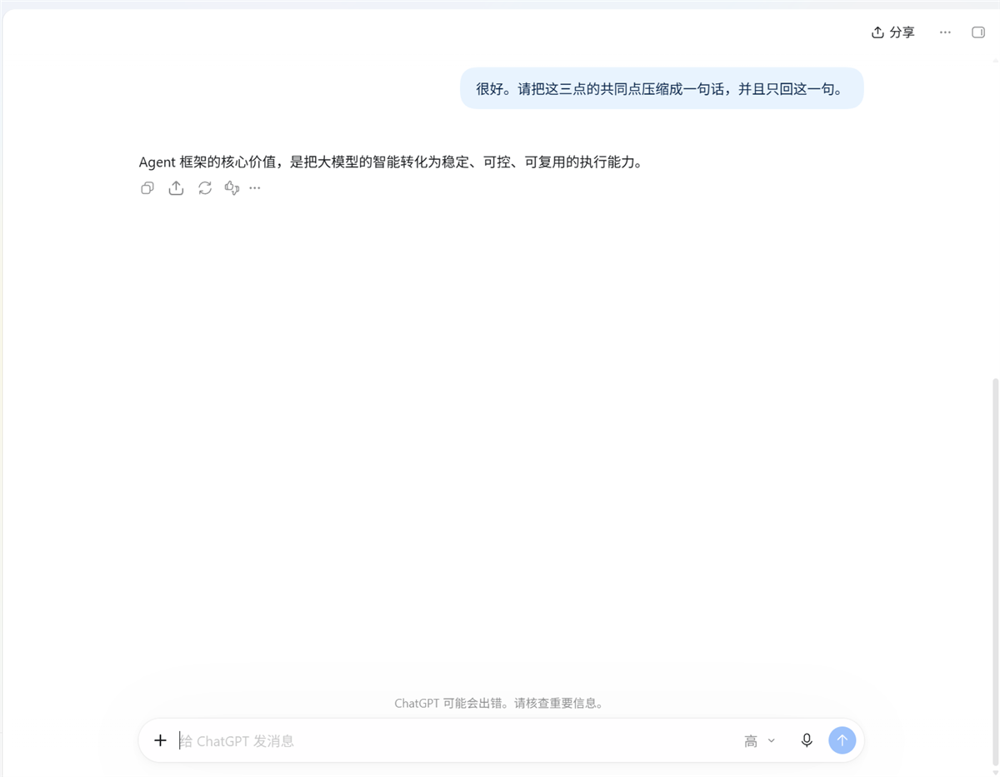

# dsh-win-computer-use

> 状态：✅ 已交付 · 发布件就绪（尚未进社区目录）
>
> [English →](README.md)

Windows 原生的 DSH 电脑操控插件。**一个批量工具**把「找控件 → 点击 → 输入 → 等条件 → 截图」
整串放进**一次引擎请求**里跑完，并且默认走**免聚焦**通道 —— agent 在这台机器上干活，
**不占用你正在用的桌面**。



## 省多少（实测）

下面这些是**读数，不是估算**。DeepSeek Harness 会把每次 assistant 消息的 `usage` 记进会话日志，
所以数字来自它自己的记录。

| | 一个动作一次工具调用 | 本插件 |
|---|---|---|
| 8 个动作（启动 → 等窗口 → 找输入框 → 输入 → 点击 → 读回 → 截图） | **8+ 轮模型请求** | **1 轮** |
| 整个对话上下文被重发 | 8 次 | **1 次** |
| 实测：单次请求重发了多少 | — | 那个 8 步批次调用是 **185,404 token**；同一长会话里每轮平均 **437,542 token**（峰值 473,134） |
| 同一件事的上下文 token 量 | 8 × 437k ≈ **3.5M** | ≈ 437k → **少 ~3.06M（88%）** |
| 引擎启动 | 每次 ~800 ms（8 次≈6.4 s） | 只付一次 ~800 ms，之后 **40–100 ms/动作** |
| 看到结果 | 截图，再发一次 `read_image` 请求 | 截图**在同一次调用里内联返回** |
| 8 步任务的墙钟 | — | **1 次调用、引擎内 1.4 s**，目标窗口全程不在前台 |

关键在于**轮数**，不在 schema。每一次请求都要重发整个对话上下文 —— 那才是每轮按输入计费的东西，
也是为什么「八次调用并成一次」远比「把工具定义压掉几百字节」重要。

**schema 也如实说：** 把 8 个单动词工具并成 2 个，这一块**反而变大了** ——
**4,149 → 6,977 字符**，因为 `computer` 的 step schema 文档了 41 个字段。它是每轮都在的**固定前缀**、
走提示词缓存命中；把它写大是**刻意的取舍**：字段说明换的是模型**第一次就把整个 `steps` 写对**。
省掉一次重试的价值远大于这点前缀 —— 一次重试就是又一次完整上下文重发，本次实测里最贵的单次请求
是 **386,879 个未命中输入 token**。

## 该不该派子代理（两组实测）

同一件事既可以主代理自己做，也可以**派子代理**去做。省不省只取决于一件事 —— **主代理本来要几轮**。
两种情形都做了对照，两边的 token 都用会话日志量出来：

**① 不看屏幕就能写全的任务**（同机同任务）：

| 做法 | 代价 |
|---|---|
| 主代理直接做（一次 `computer` 批量调用） | **522,925** —— 1 轮 |
| 派子代理做 | 525,007 + **99,092**（子代理 5 轮）= **624,099** |

派出去**贵 19%**：一次批量调用一轮就做完了，而新起的子代理要五轮。所以「操作就派子代理」是错的。

**② 冷启动的多轮任务**（窗口随机显示一个取件码，不读屏幕就没法知道该填什么，主代理天然一轮做不完）：

| 做法 | 代价 |
|---|---|
| 主代理直接做 | 559,092 + 560,636 + 562,535 = **1,682,263** —— 3 轮 |
| 派子代理做 | **565,459**（1 轮）+ **98,535**（子代理 5 轮）= **663,994** |

派出去**省 61%**。两组都自证通过（`status: OK 2776` / `status: OK 7152`），且两边全程没抢前台。

起作用的就是两个常数：**主代理一轮 ≈ 56 万 token，子代理一轮 ≈ 2 万** —— 差 28 倍。
子代理那一侧几乎不随复杂度增长，主代理那一侧是线性涨的，所以**任务越复杂省得越多**：

| 主代理本来的轮数 | 自己做 | 派子代理 | 省 |
|---|---|---|---|
| 1（能一次写全） | 0.56M | 0.66M | **−15%（别派）** |
| 2 | 1.12M | 0.64M | 43% |
| 3 | 1.68M | 0.66M | **61%（实测）** |
| 5 | 2.80M | 0.70M | 75% |
| 10 | 5.60M | 0.80M | 86% |
| 20 | 11.2M | 0.99M | 91% |

**越复杂省得越多，上限约 96%。**

### 路由规则

1. **不看屏幕就能把整个 `steps` 写全？**（打开 X → 在 Y 输入 Z → 点确定 → 截图确认）→ **自己做，一次调用**。派出去更贵。
2. **否则** —— 下一步取决于屏幕上读到什么、或者要多阶段推进 → **整件事交给子代理**，而且**别自己先探一遍**：先探一遍等于把探索成本又付一次，还是按主代理那侧的贵价付。

### 复用同一个子代理（实测）

后台子代理是 durable 的 —— 同一个操作代理被 `send_message` 派了第二个任务，照样做成（`mirror=reuse-arm-ok`，6 步，未抢前台）。
两个任务在这一个子代理里合计 **120,803** token，而它每轮的上下文只从 18,496 涨到 21,554：**复用不会把它撑大**。

但它仍然省不出钱来。后台子代理每交回一个结果，父代理就**多一轮**；而父代理一轮 ≈ 52.5 万 token ——
约等于那两个任务全部子代理开销的 **14 倍**。复用值得做，但理由是别的（操作代理积累了这台机器的界面知识，父上下文也不必再吸收第二份简报），不是省 token。

这套协议随插件以 **`computer-operator`** skill 形式提供：不加载时只占目录里一行。

## 为什么不一样

| | |
|---|---|
| **不抢你的操作** | 输入默认走 UIA 模式与 Win32 消息，窗口不在前台也能生效；截图走 `PrintWindow`，被遮挡也能拍。万不得已要物理输入时，结束会把前台窗口和光标位置还回去。`mode:"background"` 做不到就报错，绝不偷偷接管你的屏幕。 |
| **步骤按控件定位，不算坐标** | `find` 找到控件、`as:"ref"` 记住它，`click` / `type` 直接点名控件，不用你从截图里换算像素坐标。 |
| **常驻引擎** | 后台引擎把 PowerShell/UIA 的初始化留热，`Add-Type` 只付一次。空闲（默认 10 分钟）自行退出；带内容指纹，改了引擎下一次调用自动换新，不用重启。 |

## 两个工具

刻意只有两个：一个动作一个工具，等于每轮请求都要为那些 schema 付一遍 token。

| 工具 | 作用 |
|---|---|
| `computer` | 传 `steps: [{op, …}, …]`：`find` / `click` / `type` / `key` / `wait` / `shot` / `windows` / `uia` / `mouse` / `focus` / `clipboard` / `process` / `display` / `sleep`。步骤可以用 `as:"ref"` 引用前面找到的控件，**按控件点击，不必换算坐标**；`shot` 放最后一步会把图片直接返回。 |
| `computer_shot` | 只截图。给 `window`/`pid` 走 `PrintWindow` **离屏抓取、不激活窗口**；也支持 `region` / `display` / `scale`。 |

```jsonc
// 一次调用：新开会话 → 打字 → 发送 → 等回复 → 截图
{"steps": [
  {"op": "click", "window": "ChatGPT", "name": "新聊天"},
  {"op": "wait",  "window": "ChatGPT", "type": "Edit", "timeout_ms": 8000},
  {"op": "type",  "window": "ChatGPT", "type": "Edit", "text": "你好", "mode": "background"},
  {"op": "key",   "keys": "enter", "window": "ChatGPT"},
  {"op": "sleep", "ms": 7000},
  {"op": "shot",  "window": "ChatGPT"}
]}
```

## 后台优先的三层策略

`mode` 缺省 `"auto"`：先试免聚焦层，不成才退回物理输入。`mode:"background"` **做不到就报错**，
绝不偷偷接管你的屏幕；`mode:"physical"` 才真的抢焦点，而且**会还回去**。

| 动作 | 第 1 层（免聚焦） | 第 2 层（免聚焦，老控件） | 第 3 层（借桌面） |
|---|---|---|---|
| 点击 | UIA `Invoke` / `SelectionItem` / `Toggle` / `ExpandCollapse` | `BM_CLICK`、`WM_LBUTTONDOWN+UP` 直发控件 | `SetCursorPos` + `mouse_event` |
| 输入 | UIA `ValuePattern.SetValue` | `WM_SETTEXT`，**写后读回校验**才认成功 | `SendInput` 逐字符（任意 Unicode，含中文） |
| 按键 | —（组合键必须过 OS 输入队列，**没有诚实的后台形式**） | — | `keybd_event` |
| 截图 | 指定窗口时 `PrintWindow(PW_RENDERFULLCONTENT)` | — | `CopyFromScreen` |

后台层每次都要**自证**：`WM_SETTEXT` 写完会读回比对，不相等就不算成功。

## 环境要求

- **仅 Windows**（`apply()` 对 `process.platform` 有硬校验）。
- 引擎用 **Windows PowerShell 5.1**（`powershell.exe`）—— 它自带 `UIAutomationClient` 与
  `System.Drawing`，PowerShell 7 没有。
- dsh web `0.1.x`。

## 安装

```sh
dsh plugin --profile web add github:wwwort/dsh-win-computer-use
```

发布到 npm 后，`dsh plugin --profile web add dsh-win-computer-use` 也可用。

## 构建

`lib/` 是**预构建产物且已提交**，安装过程不会构建任何东西。要自己重建：

```bash
DSH_CHECKOUT=<dsh 源码 checkout> bash scripts/build.sh
node scripts/preflight.mjs        # 校验 dsh.bundle 清单与真实入包清单
```

## 实测（2026-09-19，2560×1600，Windows 11）

| 项 | 结果 |
|---|---|
| 一件事一次调用 | 8 步（启动应用 → 等窗口 → 找输入框 → 输入 → 点击 → 读回标签 → 截图）：**1 次调用、1.4 s** |
| 后台输入 | `uia.valuePattern` / `win32.wm_settext`，读回 `bg-typed 中文 OK`，**目标窗口全程不在前台**，前台始终是用户自己的窗口 |
| 后台点击 | `win32.bm_click`，应用自己的点击计数变成 1 |
| 离屏截图 | 被别的应用遮挡的窗口完整抓到（`source: "printwindow"`） |
| 冷/热调用 | ~800 ms（一次性进程）→ 42–104 ms（常驻引擎） |
| 改引擎 | 改 `win.ps1` 后下一次调用自动退休旧引擎并起新的；1 行日志，无重试风暴 |
| 上面的第 2、3 轮 | 追问引用了上一轮的回答 —— 同一个会话，全程由工具调用驱动 |

本仓库里的截图就是那次运行的真实抓取，**裁掉了无关的桌面内容**（侧栏、账号、用量等）。

## 已知边界

- **仅 Windows。**
- **`key` 没有后台实现** —— 要零打扰就用 `type`（写值）或 `click`（Invoke）。
- **老控件**（WinForms 等）在 UIA 下常常只暴露 `Pane`、无任何 Pattern，走 Win32 消息层；
  **Chromium 渲染区**不接受 `WM_SETTEXT`，浏览器页面只能靠 UIA `ValuePattern` 或物理输入。
- contenteditable 输入框可能接受了 `SetValue` 却仍报告占位符，因此 `type` 返回
  `verified: true|false` 加一句说明，而不是暗示一定成功。
- **人机并发**：「设坐标 → 点击」不是原子操作，指针没到位时引擎**拒绝点击**并报出指针真实位置。
- UIA 遍历在复杂窗口上可能数百毫秒；`uia` 会在 `max_nodes` 处截断并说明。
- 窗口标题是子串匹配，**零宽字符会让匹配失败** —— Edge 自己的标题里就有一个。
- `windows restore` 会激活窗口（`SW_RESTORE`）；最小化的窗口不恢复就没法有意义地抓取。

## 许可

BSD-3-Clause。
